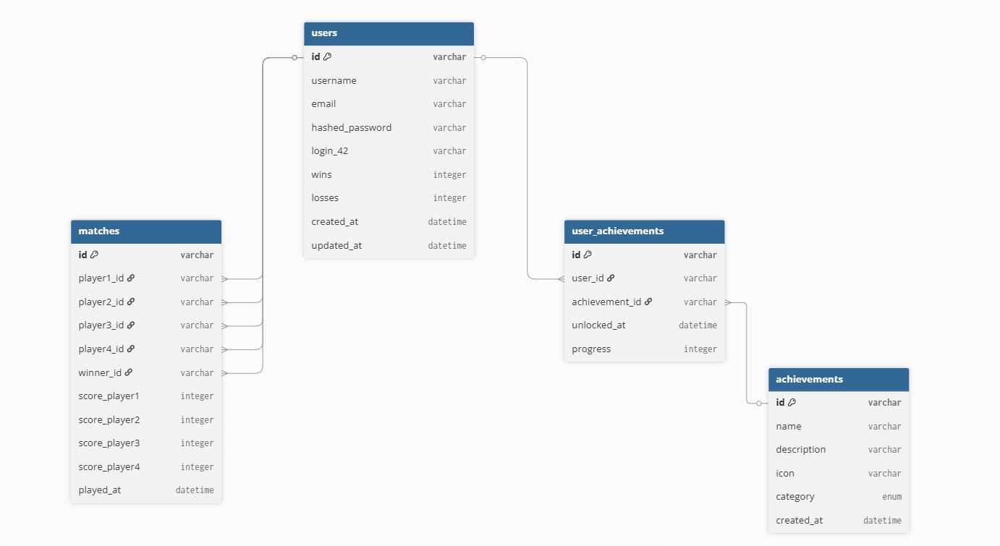

*This project has been created as part of the 42 curriculum by abkhefif, atucci, lpennisi, tcaccava.*

# ft_transcendence

## Description

**ft_transcendence** is the final project of the 42 common core.
The **goal** is to create a web-based platform for users to play Pong in real-time against others, featuring a complete user management system and a modern functional interface.

### Key Features

* **Real-time Multiplayer:** High-performance gameplay via WebSockets.
* **Social System:** User profiles, match history, and statistics.
* **Responsive Design:** A custom-made UI that works across all devices.
* **Deployment:** Fully containerized architecture using Docker.

---

## Instructions

### Prerequisites

The following tools must be installed to run the project:

* **Docker & Docker Compose** (v.29.1.3 or later)
* **Make** (for build automation)
* **Git** (to clone the repository)

### Installation & Execution

Follow these steps to set up the project locally:

1. **Clone the repository:**
   
   ```bash
   git clone https://github.com/Ruy41321/42_Trascendence.git
   cd 42_Transcendence
   ```
2. **Environment Configuration:**
   
   ```bash
   cp .env.example .env
   # Edit .env with your specific configuration
   ```
3. **Launch the Application:**
   
   ```bash
   make up
   ```
4. **Access the Project:**
   - `https://localhostPort:4443`

---

## Resources

* **Subject PDF** - [42 Subject PDF](Doc/en.subject.pdf)
* **Database Schema** - [DB_SCHEMA](Doc/database_schema.html)
* **AUTH API Documentation** - [API_GUIDE.md](Doc/API_GUIDE.md)
* **Game Frontend - Backend WebSocket Protocol** - [WEBSOCKET_PROTOCOL.md](Doc/WEBSOCKET_PROTOCOL.md)
* **Docker Infrastructure** - [Docker README](docker/README.md)
* **SSL Certificates** - [Certs README](docker/certs/README.md)
* **AI Usage** - [AI Usage](#ai-usage)

---

## Team Information

Below is the information regarding the team members and their specific roles:

| Member       | Assigned Role(s)    | Responsibilities                                                                        |
|:------------ |:------------------- |:--------------------------------------------------------------------------------------- |
| **Lpennisi**    | PO, PM, Game Fronted Dev | Ensure the final product meets the project requirements. Develop the frontend rendering of the game. |
| **Atucci**  | Frontend Dev  | Develop the frontend interface in a scalable and component-based manner. |
| **Tcaccava** | Game Logic & Web Socket Backend Dev   | Develop the game logic and Real-time socketing. |
| **Abkhefif**    | REST Backend Dev   | Develop the REST API and database integration. |

---

## Project Management

### Work Organization

* **Task Distribution:** Work was split by technical domain (Frontend, Backend, Game) with tasks tracked via `Github Issues`.
* **Meetings:** The team held regular synchronization meetings to ensure smooth integration, using `Discord` .

### Communication & Tools

* **Management Tools:** GitHub Issues.
* **Communication:** Discord and Whatsapp were used as the primary channel for daily updates.

---

## Technical Stack

| Category     | Technology    | Justification                                            |
|:------------ |:------------- |:-------------------------------------------------------- |
| **Frontend** | Vue.js | Used as frontend framework for its reactivity and component-based architecture |
| **Backend**  | FastAPI | Used as backend framework to learn python |
| **Database** | PostgreSQL, Alembic, PyTest, SQLAlchemy | PostegreSQL because it's light and fast, Alembic for database migrations, PyTest for testing database operations, SQLAlchemy for ORM |
| **DevOps**   | Docker  | Chosen for environment consistency and deployment speed. |

---

## Database Schema

### Structure Description



### Tables and Relationships

| Table | Relationships |
|:------|:-------------|
| **users** | Referenced by matches (player1-4, winner) and user_achievements (user_id) |
| **matches** | player1_id, player2_id, player3_id, player4_id, winner_id → users.id |
| **achievements** | Referenced by user_achievements (achievement_id) |
| **user_achievements** | user_id → users.id, achievement_id → achievements.id |

### Key Fields

| Table | Field | Type | Constraint |
|:------|:------|:-----|:-----------|
| users | id | varchar(36) | PK |
| users | username | varchar(36) | Unique |
| users | email | varchar(100) | Unique |
| users | hashed_password | varchar(255) | |
| matches | id | varchar(36) | PK |
| matches | player1_id, player2_id | varchar(36) | FK → users.id |
| matches | player3_id, player4_id | varchar(36) | FK → users.id, nullable |
| matches | winner_id | varchar(36) | FK → users.id |
| achievements | id | varchar(36) | PK |
| achievements | name | varchar(100) | Unique |
| user_achievements | id | varchar(36) | PK |
| user_achievements | user_id | varchar(36) | FK → users.id |
| user_achievements | achievement_id | varchar(36) | FK → achievements.id |

---

## Features List

| Feature            | Member(s)      | Functionality Description                     |
|:------------------ |:-------------- |:--------------------------------------------- |
| **Base Web-App Frontend** | Atucci & Lpennisi | Frontend implementation for the web application. |
| **Game Rendering** | Lpennisi | Core game rendering based on events sent by game backend. |
| **Game Backend** | Tcaccava | Backend logic for game mechanics, physics, and real-time synchronization. |
| **Auth System**    | Abkhefif       | Secure user registration and login backend. |
| **Auth API**       | Abkhefif       | API endpoints for authentication. |

---

## Modules

**Total Points: 14/14** 

| Module                 | Type  | Member         | Justification |  Implementation                                                                        |
|:---------------------- |:----- |:-------------- |:--------------------------------------- |:------------------------------------ |
| **Implement a complete web-based game where users can play against each other.** | Major (2) | Everyone | Because we are passionated about gaming | Implemented a real-time Pong game. |
| **Remote players — Enable two players on separate computers to play the same game in real-time** | Major (2) | Tcaccava | All the modern games work like this so we wanted to learn how to implement it. | Implemented Real-time async.io routine running on 60hz. |
| **Multiplayer game (more than two players).** | Major (2) | Tcaccava | It's funnier to play with more people | Implemented a lobby based game with four players room. |
| **Implement spectator mode for games.** | Minor (1) | Tcaccava | To include who joins the lobby after the match starts | Implemented spectator based payload. |
| **Use a backend framework (Express, Fastify, NestJS, Django, etc.).** | Minor (1) | Abkhefif & Tcaccava | To learn how to use a backend framework & to learn python | Implemented FastAPI as backend framework. |
| **Implement real-time features using WebSockets or similar technology** | Major (2) | Tcaccava | To learn how to implement real-time features | Implemented native WebSocket communication for game state broadcasting. |
| **A public API to interact with the database with a secured API key, rate limiting, documentation, and at least 5 endpoints** | Major (2) | Abkhefif | To deepen my knowledge and experience with backend development, specifically Python and its FastAPI framework. | Implemented 14 REST API endpoints (auth, users, matches, achievements, stats) with JWT authentication, API key validation, rate limiting, and Swagger/OpenAPI documentation. |
|**Use an ORM for the database.** | Minor (1) | Abkhefif | To simplify database interactions and maintain clean, maintainable code through object-relational mapping. | Implemented SQLAlchemy 2.0 as ORM with 4 models (users, matches, achievements, user_achievements) and Pydantic schemas for data validation. |
|**Use a frontend framework (React, Vue, Angular, Svelte, etc.)**| Minor (1) | Lpennisi & Atucci | To learn how to use a frontend framework | Implemented Vue.js as frontend framework. |
| **Custom-made design system with reusable components, including a proper color palette, typography, and icons (minimum: 10 reusable components).** | Minor (1) | Lpennisi & Atucci | To learn how to create a design system and reusable components | Implemented a custom design system with reusable Vue components. |
| **Support for additional browsers.** | Minor (1) | Lpennisi & Atucci | To ensure accessibility across different platforms | Implemented cross-browser compatibility for Chrome, Firefox. |

---

## Individual Contributions

### Lpennisi

* **Contributions:** Managed the github repository and Implemented the frontend game view.
* **Challenges:** 
1. Synchronizing game state between client and server has been the major challenge, it has been overcome by implementing a robust event-driven architecture with a rigorous protocol for state updates.
2. Maintaining a clean and working repository has been a challenge when multiple branches and features were being developed simultaneously, it has been overcome by enforcing the use of Github Issues.

### Atucci

* **Contributions:** Designed and implemented the frontend interface of the Web-app.
* **Challenges:** 
1. To learn a new frontend framework (Vue.js) and to implement a complex UI with reusable components was the major challenge. It has been overcome by following Vue.js documentation and best practices, and by creating a design system to ensure consistency across the application.

### Abkhefif

* **Contributions:** Designed and implemented the REST backend, including JWT authentication, database schema with SQLAlchemy, and API endpoints for user management, matches, achievements, and statistics.
* **Challenges:** 
1. Learning REST API architecture and backend development with Python and FastAPI from scratch. Overcome by studying the documentation and iterating on the code structure to achieve a clean separation of concerns.

### Tcaccava

* **Contributions:** 

Designed the full game backend — including physics engine, real-time WebSocket server, lobby system, and Docker containerization. Developed a normalized coordinate system for multi-player Pong supporting 2 to 4 simultaneous players with dynamic wall bounce when sides are unoccupied. Implemented a 60fps server-side game loop with asyncio, AABB collision detection with angular bounce, client-side prediction support via input reconciliation, and a lobby queue with automatic slot promotion on disconnect. 

* **Challenges:**
 
1. Managing concurrent WebSocket coroutines,one for each connected player + the world loop one, safely in a single-threaded asyncio environment was the primary challenge. Race conditions on rapid reconnection (page refresh during a match) caused cascading disconnections across all connected clients. Identifying the root cause was extremely difficult and took days of hard work: the root cause was asyncio.gather propagating exceptions from dead WebSockets into active player coroutines. Solved by adding return_exceptions=True to all gather calls and introducing WebSocket ownership verification before clearing player slots in the disconnect handler.
2. Designing a game state architecture that supports variable player counts (2 to 4) without breaking the physics, scoring, or lobby logic required careful separation between slot state and connection state — a distinction that also proved critical for handling disconnections and reconnections gracefully during an active match.


---


## AI Usage

AI tools were used during the project for the following tasks:

* **ChatGPT chatbot** has been used to learn the FastAPI theory.
* **Gemini chatbot** has been used to learn python basics and Typing/Pydantic Library as well as specific vueJS concepts.
This AI has also been used to discuss on ideas of implementation to find lacks and gather suggestions on how to set a correct architecture for the project.
* **Github Copilot** has been used to speed up the development process by providing code suggestions, autocompletions and understand the reason behind some tedious bugs.
* **Github Copilot Agent** has been used to complete repetitive coding tasks, such as replace css styles with new ones after a design change, and to generate documentation to interface the frontend with the backend.

* **Claude chatbot** has been used to learn Python basics and FastAPI framework concepts for backend development.
