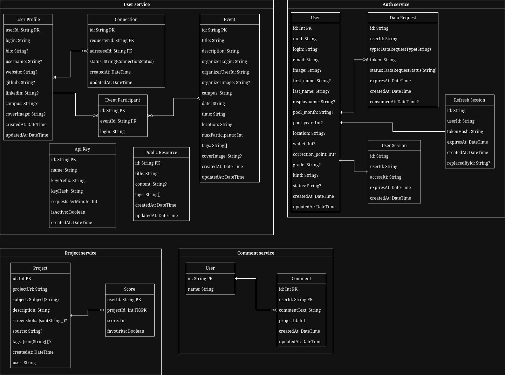

# Ft_Transcendence

*This project has been created as a part of the 42 curriculum by fcarlucc, ihhrabar, sgasperi, engiral, athekkan.*

## Description

42 Share is a social platform for students of the 42 School to share, explore and display their finished curriculum projects. The goal of the project was to design and implement a web application, through which 42 students would be able to interact and connect with each other, share their experiences with implementing projects, and their end result.

## Team Information

* Flaviano - Product Owner/Technical lead - Fullstack developer + Devops engineer
* Ihor - Project Manager - Fullstack developer
* Sara - Frontend developer/Accessibility lead - Frontend developer
* Enrico - Frontend developer/Legal consultant - Frontend developer
* Angelo - Frontend developer - Frontend developer

## Project Management

The work on the project has been organized by Flaviano (fcarlucc) and Ihor (ihhrabar). Tasks were split equally across all of the teammates, in a manner that would allow all 5 of us to work simultaneously on the project. Meetings were organized on a weekly basis with the purpose of sharing knowledge, reporting progress to each other and providing mutual feedback.

We used Discord to perform these meetings, Whatsapp for general communication, Github issues to track and report encountered issues and problems, and Github project board to track the progress of our work.

## Technical Stack

We used the following technologies to build our software:

* [Turborepo](https://turborepo.dev/) - Our build system.
* [Nest.js](https://nestjs.com/) - The primary framework for our backend microservices.
* [Prisma.io](https://www.prisma.io/) - The ORM we used in our microservices.
* [PostgreSQL](https://www.postgresql.org/) - The database, used in auth- and user-services.
* [SQLite](https://sqlite.org/index.html) - The database, used in comments- and project-services.
* [Garage](https://garagehq.deuxfleurs.fr/) / [MinIO](https://min.io/) - S3-compatible storage (Garage optional for local dev; MinIO in Docker).
* [Next.js](https://nextjs.org/) - The fullstack framework for our frontend.
* [Tailwind CSS](https://tailwindcss.com/) - Styling framework for our frontend.
* [Docker](https://www.docker.com/) - Containerization solution.

This stack of technologies was chosen primarily due to our familiarity with such technologies. Our microservice architecture allowed us to even use different database engines without any conflicts, granting our developers a major productivity boost.

## Database Schema

This project uses multiple database schemas. All of these can be found inside of `prisma/schema.prisma` in each microservice of the project.

Here is a visual chart of all of these:



## Features List

* Well-designed frontend - a pleasant frontend experience with a decent design that is nice to work with. (Enrico, Sara, Flaviano, Angelo)
* 42 OAuth2 authentication - use of 42 OAuth2 services for user authentication. (Flaviano)
* Account data management - setting up user aliases and custom profile backgrounds. (Flaviano, Enrico)
* 42 project management and search - project creation, deletion, listing and display. (Ihor, Sara, Enrico)
* Accessibility, theming and translations - ability for the user to choose a frontend language, theme and configure various accessibility options. (Sara, Ihor)
* GDPR compliance - ability for the user to request data in a readable format, or its complete removal. (Flaviano, Ihor)

## Modules

We have chosen the following list of modules to complete in our project, because we believe it encapsulates a mandatory set of features our project must have to be deemed functional. The sum of the following modules ends up having 21 points (6 major + 9 minor modules).

### Web
	* [Major] Frontend + Backend framework use (all of us) - this module was mandatory for us to achieve optimal development velocity. Achieved with Next.js and Nest.js
	* [Minor] Search system (Ihor, Enrico) - the ability to search projects is a core feature of our application. Achieved with ORM use.
	* [Minor] File upload and management (Ihor, Flaviano) - the ability to upload files (screenshots, images, archives) is a core feature of our application. Achieved with S3 storage integration
	* [Major] Public API (Flaviano) - a nice-to-have feature, allowing third parties to develop tools that can interact with our service. Implemented on the gateway + user-service. See [PUBLIC_API.md](./PUBLIC_API.md).
	* [Minor] ORM use (Flaviano, Ihor) - mandatory for us to achieve optimal development velocity. Achieved with Prisma.
	* [Minor] SSR (Flaviano, Enrico, Angelo) - a nice-to-have for a better user experience. One of core Next.js features.
### Accessibility
	* [Minor] Multiple languages (Sara) - crucial, since the project is meant for all 42 students, which is an international audience.
	* [Minor] Additional browser support (Sara, Angelo) - important feature to remove friction for various users to access our services. One of core features of Next.js.
	* [Major] Complete accessibility compliance (Sara) - also important feature to remove friction for various users to access our services. Achieved with Next.js.
### User management
	* [Major] Standard user management (Flaviano) - a core feature of our service.
	* [Minor] Remote auth (Flaviano) - utilizing 42 OAuth2 instead of rolling out our own was a crucial decision that also aided our development velocity. Achieved with 42 API.
### Devops
	* [Major] Use microservices (Flaviano, Ihor) - a design choice that allowed our backend developers to work in parallel. Achieved with TurboRepo.
	* [Major] Monitoring system with Prometheus and Grafana (Flaviano) - important monitoring tools, allowing us to observe the status of our services.
### Data and analytics
	* [Minor] GDPR compliance (Ihor, Flaviano) - we believe this is an important aspect of our application. Confirmation emails use the Gmail API (see `MAIL_*` in `.env.example`).
### Custom
	* [Minor] S3 storage integration (Ihor) - crucial component of our stack. Implemented with AWS JavaScript SDK + Garage/MinIO. More details below.

This is one and only Module of Choice we have decided to implement into the project. Considering that our primary goal is to allow students to share their works of 42 projects, we needed a storage solution that would be both decently performant, and allowed us to provide a controlled access to our resources. S3 was designed with these goals in mind in a way no other solution available to us was (such as storing files in the database or working with Nest.js local file storage APIs).

Implementing one from scratch was not a viable solution for us, since we lack the technical capability to construct a performant system, that would manage the access to file resources, allow uploads without conflicts in a timeframe given to us. And, given the industrial relevance of S3, we have ultimately focused on studying it in depth and integrating an existing working solution into our project.

## Individual contributions

### Flaviano

The technical lead of the project. Fullstack developer. Worked on:
* The overall backend structure of the project with Turborepo
* User and Auth services
* General frontend direction
* 42 OAuth2 integration
* Containerization
* Prometheus and Grafana integration

### Ihor

Second technical lead of the project, and a fullstack developer. Worked on:
* Project and Comment services
* General frontend direction
* General project planning
* S3 storage integration
* GDPR email flows

### Sara

Frontend and accessibility developer and designer. Worked on:
* Project display and settings pages
* Theming support
* Accessibility options
* Languages and translations

### Enrico

Frontend developer. Worked on:
* Overall frontend look
* Project upload and editing pages

### Angelo

Frontend developer. Worked on:
* Overall frontend look
* UX consistency

---

## Getting started

Two ways to run the project: **Docker** (`make up`) or **local dev** (`make dev`). Both use the **same HTTPS URL** and **one 42 OAuth redirect URI**.

| Mode | How to run | Open in browser |
|------|------------|-----------------|
| Docker | `make up` | `https://localhost:8443` |
| Local dev | `make dev-setup` then `make dev` | `https://localhost:8443` |

Turbo still listens on `:3000` / `:4000` locally; a small nginx container terminates TLS and proxies to them (same as Docker’s single-origin setup).

**42 OAuth:** register **once** on [intra.42.fr](https://intra.42.fr):

`https://localhost:8443/api/auth/callback`

Set `CLIENT_ID` / `CLIENT_SECRET` in `.env`. Set `WEBAPP_URL`, `NEXT_PUBLIC_API_URL`, and `REDIRECT_URI` in `.env` too (see `.env.example`).

**JWT keys:** generated automatically into `./keys/` by `make up`, `make dev`, or `make prepare` (gitignored).

**TLS:** self-signed cert in `infra/certs/` (auto-generated). Accept the browser warning once. Do not run `make up` and `make dev` at the same time — both use port `8443`.

### Docker (recommended)

From the repo root:

```bash
make up       # creates .env, .env.docker, JWT keys if missing; builds and starts the stack
make seed     # optional: demo users, connections, sample data
make logs     # follow container logs
make down     # stop containers
```

After `make up`, open **https://localhost:8443** (or the URL printed at the end). MinIO and Prisma Studio stay on HTTP admin ports.

Optional:

```bash
make rebuild     # force recreate containers
make ps          # container status
```

### Local development

Tested on macOS and Fedora Linux. **Not supported under WSL.**

Prerequisites: Node.js/npm, Docker (for Postgres only).

```bash
cp .env.example .env          # then fill CLIENT_ID, CLIENT_SECRET, optional MAIL_*
make dev-setup                # first time: Postgres container + all migrations
make dev                      # Turbo + HTTPS proxy → open https://localhost:8443
```

If ports are stuck after a crash or Ctrl+C:

```bash
make dev-clean
make dev
```

Database helpers (local only):

```bash
make dev-db        # start Postgres container
make dev-migrate   # prisma generate + migrate (Postgres + SQLite services)
```

### npm scripts (repo root)

| Command | Purpose |
|---------|---------|
| `npm run dev` | Same as `make dev` (loads `.env`) |
| `npm run db:migrate` | Apply migrations on all services |
| `npm run prisma:generate` | Regenerate Prisma clients |
| `npm run db:seed` | All demo data (users, events, 15 projects, public API key) |
| `make seed-local` | Same with `.env` loaded + `prisma:generate` (local dev) |
| `npm run db:seed:reset` | Wipe seed fixtures, then full re-seed |
| `npm run db:seed:invitations -- <login>` | Pending invites to your 42 login |
| `npm run db:seed:public-api` | API key only ([PUBLIC_API.md](./PUBLIC_API.md)) |

### Testing & demo data

See [scripts/README.md](./scripts/README.md) for seed commands, Public API curl examples, and manual test flows.

Per-service notes: [apps/gateway](./apps/gateway/README.md), [apps/auth-service](./apps/auth-service/README.md), [apps/user-service](./apps/user-service/README.md), [apps/web](./apps/web/README.md).

### Environment files

| File | Used by |
|------|---------|
| `.env` | Local dev + shared secrets (OAuth, JWT paths, DB URLs) |
| `.env.docker` | Docker-only URLs and ports (from `.env.docker.example`) |
| `apps/project-service/.env` | Optional SQLite path override (see `.env.example` there) |
| `apps/comments-service/.env` | Optional SQLite path override (see `.env.example` there) |

Copy templates with `cp .env.example .env` and `cp .env.docker.example .env.docker`.

---

## Resources

During the creation of the project, we used the following resources for studying and referencing:

* [Next.js Docs](https://nextjs.org/docs)
* [Nest.js Docs](https://docs.nestjs.com/)
* [Prisma Docs](https://www.prisma.io/docs)
* [Garage Docs](https://garagehq.deuxfleurs.fr/documentation/quick-start/)
* [Tailwind CSS Docs](https://tailwindcss.com/docs/editor-setup)
* [Turborepo Docs](https://turborepo.dev/docs)

There is a wide variety of other minor internet resources used during the creation of this project. Such resources are mostly referenced inside of comments in the code of the project.

Major portions of user frontend, as well as its design was created with the use of AI assistance.
