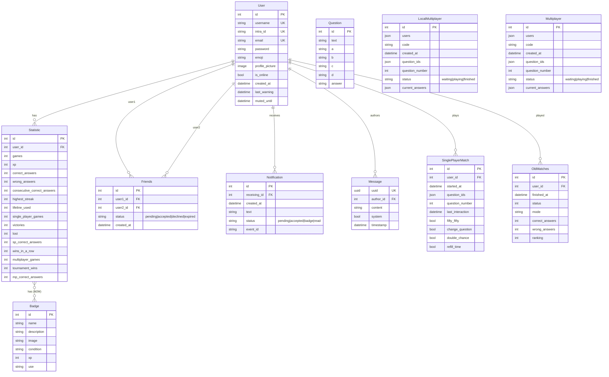

*This project has been created as part of the 42 curriculum by smarinel, ldei-sva, flo-dolc, gvigilan, lgaudino.*

## Description

### The Goal
**ft_transcendence** is the final, crowning achievement of the 42 Common Core curriculum. The objective of this project is to build a fully functional, secure, and real-time multiplayer web application from scratch. It serves as a comprehensive test of full-stack software engineering capabilities—requiring advanced knowledge of containerization, asynchronous backend architectures, single-page application (SPA) design, real-time networking protocols, and strict web security standards.

### Overview
Our implementation transforms the traditional scope of this project into a highly sophisticated, gamified **Real-Time Trivia & Quiz Platform**. Built on a containerized multi-service architecture using **Docker**, the application delivers a seamless single-page user experience powered by **Next.js** and **TypeScript** on the frontend, and a robust asynchronous **Django (Python)** engine on the backend. 

Instead of dealing with basic static web cycles, our platform is deeply event-driven. Through a heavy integration of **WebSockets (Django Channels & Daphne)**, users can experience low-latency global chats, live push notifications, and high-concurrency multiplayer matches. The platform is enriched with an automated AI content moderator, a custom internationalization (i18n) framework, public profile tracking with modular level progression, and an automated badge/achievement unlock engine.

By combining rigorous industrial security practices—such as **Argon2** password hashing and strict **Nginx SSL/TLS** connection termination—with innovative gameplay features (like transforming smartphones into local multiplayer controllers), this project showcases a production-ready approach to modern web application development.

## Getting Started & Installation

Thanks to our fully containerized architecture, deploying and running the entire platform locally requires only a few simple steps using **Docker** and our included **Makefile**.

### Prerequisites
Ensure you have the following installed on your host machine:
* [Docker](https://docs.docker.com/get-docker/)
* [Docker Compose](https://docs.docker.com/compose/install/)
* `make` utility

---

### Step-by-Step Execution

#### 1. Clone the Repository

```bash
# Note: The link below is a placeholder as the repository is currently private. 
# Replace it with your actual clone URL once available, or the link provided on the 42 intranet.
git clone https://github.com/smarinel/transcendence.git transcendence
cd transcendence

```

#### 2. Configure Environment Variables

You need to set up a .env file in the root directory. You can use the provided .env.example as a template and populate it with your necessary secret keys, database credentials, and API keys:

```bash
# Copy the example configuration to create your .env file
cp .env.example .env

# For the evaluation: Do not create this from scratch. 
# Copy and paste the configuration from the ready-to-use .env file provided by us during the defense.

```

#### 3. Compile and Launch the Project

Simply run the Makefile command to build the containers, setup the network layers, configure database volumes, and start Nginx:

```bash
make

```

###  Accessing the Application

Once the terminal logs show that all services are active and healthy, open your preferred web browser and navigate to:

https://`<your-server-ip>`:8443

Replace `<your-server-ip>` with the actual IP address configured in your `.env` file for the `HOST_IP` variable.

>  **Important Security Note:** Since the SSL certificates used for local development are self-signed, your browser will likely display a *"Your connection is not private"* warning on your first visit. This is completely normal and expected for a local deployment. Simply click on **"Advanced"** and select **"Proceed to `<your-server-ip>`:8443 (unsafe)"** to access the platform.

## Team Information

### smarinel
* **Role:** Project Manager / Lead Frontend Developer
* **Responsibilities:** * Managed project timelines, task distribution, and coordinated sensitive repository merges.
    * Architected and built the frontend application using **Next.js** and **Tailwind CSS**.
    * Implemented robust security standards on the server side, including **Argon2** integration for secure data handling.
    * Choose all the questions in the database for the quiz.

### ldei-sva
* **Role:** Product Owner / Lead Backend Developer
* **Responsibilities:** * Defined product requirements, features scope, and initial database schema design.
    * Developed the core **Django** backend architecture and contributed to REST API development.
    * Implemented the real-time notification system using **WebSockets**.

### flo-dolc
* **Role:** Tech Lead / DevOps Engineer
* **Responsibilities:** * Led technical decision-making and defined the overall system architecture.
    * Designed and managed the **Docker** infrastructure, ensuring seamless containerization of all services.
    * Migrated and optimized the database system to **PostgreSQL**.
    * Implemented secure authentication workflows via **42 OAuth**.

### gvigilan
* **Role:** Developers
* **Responsibilities:** * Developed the core real-time multiplayer Quiz game logic and matchmaking system using **WebSockets**.
    * Contributed to the development and integration of backend REST APIs.
    * Designed and implemented a custom **i18n (internationalization)** system for multi-language support.

### lgaudino
* **Role:** Developers
* **Responsibilities:** * Developed the full-featured real-time chat and messaging system using **WebSockets**.
    * Contributed to the design, implementation, and testing of backend REST APIs.
    * Assisted in frontend integration to ensure a smooth user experience across communication features.

## Project Management

### Task Distribution & Tracking
We used **Notion** as our primary collaborative workspace. 
*   **Centralized Task List:** Each team member had assigned tasks within a shared database.
*   **Progress Tracking:** We used a status-based system (To Do, In Progress, Done) allowing everyone to monitor the project's pulse in real-time.
*   **Documentation:** Notion also served as our internal wiki for sharing notes, architectural decisions, and API documentation.

### Version Control & Workflow
Our development process was strictly managed through **GitHub**:
*   **Branching Strategy:** We utilized a feature-branch workflow. No code was merged into the main branch without ensuring it was stable.
*   **Atomic Commits:** We maintained a clean history with descriptive and accurate commit messages, making it easier to track changes and debug regressions.
*   **Collaborative Review:** Direct communication during merges (managed by our PM) ensured that sensitive parts of the codebase remained consistent.

### Communication & Coordination
Effective communication was the backbone of our team:
*   **Instant Messaging:** A dedicated **WhatsApp** group was used for quick updates, urgent troubleshooting, and daily check-ins.
*   **Weekly Syncs:** We held regular video conferences via **Google Meet** to discuss roadblocks, demonstrate new features, and plan the objectives for the following week.

## Technical Stack & Architectural Choices

To build a secure, scalable, and real-time single-page application, we carefully selected our tech stack to satisfy the strict requirements of the 42 curriculum while ensuring an optimal developer experience.

### Frontend Architecture

*   **Next.js (React + TypeScript)**  
    *   *Why we chose it:* Next.js provides file-system based routing, a middleware layer for server-side authentication guards, and out-of-the-box performance optimizations. **TypeScript** ensured strict type-safety across the client codebase.
*   **Tailwind CSS**  
    *   *Why we chose it:* A utility-first CSS framework that allowed us to build highly responsive, complex interfaces directly within the markup. This eliminated the overhead of managing separate CSS files and significantly accelerated UI development.
*   **Native Browser WebSockets**  
    *   *Why we chose it:* For real-time features (global chat, live notifications, and multiplayer game sessions), we opted for the native WebSockets API over heavy abstractions. This kept our client bundle lightweight and granted us direct control over the protocol.
*   **Custom i18n System**  
    *   *Why we chose it:* Instead of adding bulky external dependencies like `next-intl` or `i18next`, we built a lightweight, bespoke internationalization system using a custom `useTranslation` hook paired with locale JSON files (EN, IT, ES).

### Backend Architecture

*   **Django (Python)**  
    *   *Why we chose it:* Suggested by the project guidelines, Django is a full-featured framework offering a robust built-in ORM, smooth database migration systems, and an administrative panel. Its mature ecosystem drastically simplified backend logic.
*   **Daphne (ASGI Server)**  
    *   *Why we chose it:* Since traditional Django WSGI setups cannot handle persistent WebSocket connections, we deployed Daphne as our ASGI server to natively process both HTTP and WebSocket traffic within the same lifecycle.
*   **Django Channels**  
    *   *Why we chose it:* Extends Django to handle asynchronous protocols via "consumers". It seamlessly integrates with Django's native authentication, sessions, and ORM, avoiding the need to spin up a separate WebSocket service.
*   **django-corsheaders**  
    *   *Why we chose it:* Essential middleware used to manage Cross-Origin Resource Sharing (CORS) policies, as our frontend and backend operate out of isolated containers (different origins).

### Database System

*   **PostgreSQL 16**  
    *   *Why we chose it:* PostgreSQL was our primary choice for several engineering reasons:
        1. It is the officially recommended database for the 42 subject.
        2. It natively supports JSON fields, guarantees strict ACID compliance, and offers excellent performance under concurrent user loads.
        3. It integrates flawlessly with the Django ORM via `dj-database-url`.
        4. The `postgres:16-alpine` Docker image provided a highly optimized, lightweight footprint.

### Security Implementations

*   **Argon2**  
    *   *Why we chose it:* As the winner of the Password Hashing Competition, we integrated Argon2 as Django's primary hasher. Our Project Manager (and resident cryptography enthusiast) pushed for this implementation, knowing it stands as the global industry standard for major production environments due to its superior resistance against GPU/ASIC brute-force attacks compared to bcrypt or PBKDF2.
*   **Nginx with SSL/TLS**  
    *   *Why we chose it:* Acts as our reverse proxy terminating HTTPS connections. This directly satisfies the project's "HTTPS everywhere" requirement, automatically redirecting HTTP traffic to HTTPS using secure SSL certificates.
*   **OAuth 2.0 (42 API)**  
    *   *Why we chose it:* Implemented as a third-party authentication provider to fulfill the mandatory subject requirement for seamless integration within the 42 network ecosystem, and to give the user a simpler and secure way to log in.

### DevOps & Infrastructure

*   **Docker & Docker Compose**  
    *   *Why we chose it:* To meet the requirement of deploying the entire ecosystem with a single command (`docker compose up --build`), we containerized every layer (Frontend, Backend, Database, Nginx). This guarantees an identical, isolated environment across any host machine.
*   **Nginx Routing**  
    *   *Why we chose it:* Serves as our unified reverse proxy and single entry point. It efficiently routes `/api/` and `/ws/` traffic to Django, `/` requests to Next.js, and safely handles SSL termination and WebSocket protocol upgrades.

## 🗄️ Database Schema

Our application features a fully relational database managed via the Django ORM and powered by PostgreSQL. The schema is optimized to handle user authentication, social connections, global real-time chat, notifications, and complex game statistics/match persistence.

### Entity-Relationship Diagram (ERD)

The following dynamic diagram represents the core tables and their relationships. 



## Implemented Features & Team Attribution

Below is the complete catalog of features built into the platform, along with their functional breakdown and the team members responsible for their implementation.

### Authentication & User Management
* **Local Registration & Login** — Allows users to create secure accounts using usernames, emails, and passwords. Passwords are encrypted using Argon2 hashing.  
    *Contributors:* `smarinel` | `ldei-sva`
* **42 OAuth Integration** — Features seamless single sign-on (SSO) integration utilizing the official 42 Intra OAuth2 authentication flow.  
    *Contributors:* `flo-dolc`
* **Session-based Authentication** — Implements highly secure backend session management with hardened cookie flags (`HttpOnly`, `Secure`, and `SameSite=Lax`).  
    *Contributors:* `flo-dolc`
* **Profile Customization** — Supports personalized user experiences, allowing profile picture uploads, custom emoji avatars, and user info management.
    *Contributors:* `smarinel` | `flo-dolc`
* **Real-Time Online Status** — Dynamically tracks and broadcasts whether a user is currently connected, idle, or offline across the app ecosystem.  
    *Contributors:* `flo-dolc`

### Social & Networking Features
* **Comprehensive Friend System** — Allows users to send, accept, decline, or cancel friend requests, featuring a live friend list displaying active/inactive status indicators.  
    *Contributors:* `smarinel` | `ldei-sva`
* **Global User Search** — Features an instantaneous lookup tool to find other registered users by username to view profiles or initiate social connections.  
    *Contributors:* `smarinel` | `ldei-sva`
* **Public Profiles & Match History** — Exposes customizable profile pages showcasing public player metrics, unlocked badges, and historical match logs.  
    *Contributors:* `smarinel` | `ldei-sva`
* **Real-time Notifications** — A persistent WebSocket-driven messaging pipeline that instantly delivers alerts for friend requests, badge achievements, and platform events.  
    *Contributors:* `ldei-sva`

### Global Chat Engine
* **Live Chat Server** — A high-concurrency global chat room powered by asynchronous Django Channels (WebSockets) supporting instantaneous message broadcasting.  
    *Contributors:* `lgaudino`
* **Automated System Logs** — Broadcasts structural notifications directly to the chat interface when users enter or exit the active channel.  
    *Contributors:* `lgaudino`
* **AI-Powered Chat Moderation** — Integrates automated content-checking and rules enforcement, featuring a warning threshold and temporary auto-mute behaviors with configurable durations.  
    *Contributors:* `lgaudino`
* **Contextual Message History** — Automatically fetches and renders the last 50 chat messages upon initial connection to provide immediate context.  
    *Contributors:* `lgaudino`

### Singleplayer Trivia Mode
* **Singleplayer Quiz Mode (15 Questions)** — Runs full singleplayer trivia campaigns utilizing algorithmic, random selection from a custom-curated bank of 500 questions.  
    *Contributors:* `smarinel` | `ldei-sva`
* **Aggressive Countdown Timers** — Imposes individual per-question response countdowns; failing to lock an option before expiration results in immediate match defeat.  
    *Contributors:* `smarinel` | `ldei-sva`
* **Strategic Lifelines** — Implements 4 distinct utilities: *50:50* (wipes out 2 wrong variants), *Double Chance* (grants a free retry), *Time Refill* (resets active timer), and *Change Question* (skips current card).  
    *Contributors:* `smarinel` | `ldei-sva`
* **Session State Recovery** — Prevents data loss during network failure; if a client drops mid-game, they can rejoin and resume precisely where they left off within an active window.  
    *Contributors:* `smarinel` | `ldei-sva`
* **Dynamic XP & Scoring** — Awards Experience Points (XP) scaled proportionally to question positioning and difficulty curve (later questions payout higher dividends).  
    *Contributors:* `smarinel`

### Local Multiplayer (Couch Mode)
* **Room Code Matchmaking** — Generates unique, localized multi-person matches instantly using pin-protected session code generation.  
    *Contributors:* `smarinel` | `ldei-sva`
* **Live Leaderboards** — Implements a unified local viewport rendering active, real-time score updates as participants submit responses.  
    *Contributors:* `smarinel` | `ldei-sva`
* **Mobile Buzzer Integration** — Enables secondary players to transform their smartphones into remote quiz buzzers via external responsive UI without needing a full account login.  
    *Contributors:* `smarinel`

### Remote Multiplayer (Real-Time Web lobbies)
* **High-Capacity Lobbies** — Facilitates scalable WebSocket-based lobbies supporting up to 8 real-time concurrent active competitors via room codes.  
    *Contributors:* `gvigilan`
* **Host Administration & Migration** — Gives room creators the ability to start, pause, or resume gameplay. Includes an auto-migration protocol that reassigns administrative authority if the original host disconnects.  
    *Contributors:* `gvigilan`
* **Spectator Viewports** — Permits up to 10 non-competing users to jump into active game rooms to watch live trivia streams in real time.  
    *Contributors:* `smarinel`
* **Synchronized Broadcast Cycles** — Uses global backend timers to sync question delivery exactly, establishing uniform 20-second submission loops across all connected players.  
    *Contributors:* `gvigilan`
* **Disruption Defenses** — Automatically triggers a universal lobby pause if any active player faces packet loss/disconnection, alongside manual interstitial host-pauses.  
    *Contributors:* `gvigilan`
* **Stateful Match Reconnection** — Enables disconnected web-players to seamless hot-swap back into live backend loops and synchronize with the active question window.  
    *Contributors:* `gvigilan` | `smarinel`
* **Advanced Multiplayer Hints** — Features 3 interactive lifelines: *50:50*, *Double Chance* (with immediate green success responses), and *Scrying* (allows users to read opponents' real-time selections through indigo-tinted UI indicators).  
    *Contributors:* `gvigilan` | `smarinel`

### Global Leaderboards
* **Multi-Category Rank Aggregation** — Computes and renders global user standouts across 3 competitive paths: Total Wins, Net XP, and Highest Consecutive Answer Streak.  
    *Contributors:* `ldei-sva`
* **Podium Exhibition** — Showcases the elite tier with specialized badge cosmetics (🥇🥈🥉) for top 3 position holders, linked directly to public inspection cards.  
    *Contributors:* `smarinel`

### Badges & Achievement Subsystem
* **Automated Milestones** — Background listeners monitor core statistics to trigger rewards based on specific metrics (e.g., win streaks, total correct selections, lifespan usage).  
    *Contributors:* `ldei-sva`
* **Live Achievement Unlocks** — Pairs with the notification center to flash an instant toast message across a player's screen the moment a badge requirement is fulfilled.  
    *Contributors:* `ldei-sva`
* **Badges and Achievements grid** — A dedicated gallery matrix integrated into profiles where users can audit their collected rewards alongside requirements and technical descriptions.  
    *Contributors:* `smarinel`

### Bespoke Internationalization (i18n)
* **Full Tri-Lingual Localization** — Out-of-the-box system-wide locale JSON files supporting English, Italian, and Spanish.  
    *Contributors:* `gvigilan`
* **Zero-Dependency Translation Architecture** — Built entirely as an internal, lightweight custom React hook (`useTranslation`) mapped to local JSON files, avoiding heavy internationalization third-party bundle bloat.  
    *Contributors:* `gvigilan`

### Legal, Compliance & User Safety
* **Context-Driven Privacy Policy** — Built an inline accessible privacy framework outlining actual data scopes, retention rules, and compliance standards within the platform.  
    *Contributors:* `smarinel`
* **Platform Terms of Service** — Integrates formal usage guidelines, system rule documentation, and operational protocols accessible via the primary layout footer.  
    *Contributors:* `smarinel`
* **Cookie Compliance Banner** — A specialized UX notification banner detailing storage permissions, explicitly built for user session cookie acceptance.  
    *Contributors:* `lgaudino`

### Advanced Metrics & Player Progress
* **Granular Performance Statistics** — Aggregates exhaustive user analytics (wins/losses, streak counters, answer distributions, utility usage) split between singleplayer and multiplayer scopes.  
    *Contributors:* `smarinel` | `ldei-sva`
* **Historical Ledger** — A chronological listing of completed matches showing the final outcome, selected game mode, precise point/answer metrics, and final placement.  
    *Contributors:* `smarinel` | `ldei-sva`
* **Gamified Level Systems** — Maps mathematical XP calculations to a fluid, visual user level progression bar, adding depth to the core platform loop.  
    *Contributors:* `smarinel`

## Chosen Modules & Point Calculation

To fulfill the requirements of the **ft_transcendence** subject, our team selected a strategic combination of Major and Minor modules. Each choice was carefully implemented to maximize system stability, performance, and user engagement.

### Score Summary
*   **Major Modules:** 6 modules × 2 points = **12 points**
*   **Minor Modules:** 12 modules × 1 point = **12 points**
*   ** Total Points Achieved:** **24 points**

---

### Detailed Modules Breakdown

### Web Category
#### Major: Real-Time Features via WebSockets (2 pts)
*   **Justification:** Essential for facilitating high-concurrency multiplayer gaming, synchronized trivia loops, live notifications, and instantaneous messaging.
*   **Implementation:** Developed using **Django Channels** and **Daphne** on the backend to manage asynchronous WebSocket protocols, paired with the browser's native WebSocket API on the client side.
*   **Contributors:** `ldei-sva` | `gvigilan` | `lgaudino`

#### Major: Advanced User Interaction & Social Graph (2 pts)
*   **Justification:** Necessary to transform the application into an interactive gaming community hub rather than a standalone sandbox.
*   **Implementation:** Created a fully relational social system supporting real-time friend states, global profile inspections, instant user lookup matrices, and rule-enforced interactive environments.
*   **Contributors:** `smarinel` | `ldei-sva` | `lgaudino`

#### Minor: Use a Frontend Framework (1 pt)
*   **Justification:** Chosen to ensure a highly modular single-page application (SPA) architecture with fast client-side navigation.
*   **Implementation:** Built the user interface around **Next.js** (React + TypeScript), leveraging functional hooks, unified page structures, and Tailwind utility styling.
*   **Contributors:** `smarinel`

#### Minor: Use a Backend Framework (1 pt)
*   **Justification:** Mandated to ensure stable routing, structural database safety, and efficient development velocity.
*   **Implementation:** Deployed **Django** (Python) as our primary API provider, utilizing its robust routing pipelines and asynchronous engine integration.
*   **Contributors:** `ldei-sva` | `flo-dolc` | `gvigilan` | `lgaudino`

#### Minor: Object-Relational Mapping (ORM) Integration (1 pt)
*   **Justification:** Protects the system against SQL injection attacks and provides a clean abstraction layer for handling data objects.
*   **Implementation:** Used the native **Django ORM** mapped directly to our PostgreSQL deployment to execute migrations and handle complex dynamic query lookups cleanly.
*   **Contributors:** `ldei-sva`

#### Minor: Complete Action Notification System (1 pt)
*   **Justification:** Needed to keep users instantly informed of changing server-side states (friend requests, milestones, profile warnings).
*   **Implementation:** Implemented an event-driven system where model signals trigger persistent, real-time data push notifications sent directly through active WebSocket consumer connections.
*   **Contributors:** `ldei-sva`

---

### User Management Category
#### Major: Standard User Management & Authentication (2 pts)
*   **Justification:** The primary security layer ensuring identity verification, safe profile tracking, and credential privacy.
*   **Implementation:** Implemented custom local registration, login endpoints, and session cookies configured with advanced defensive headers (`HttpOnly`, `Secure`, `SameSite=Lax`). Handled password hashing with industrial-grade **Argon2** algorithms.
*   **Contributors:** `smarinel` | `flo-dolc` | `ldei-sva`

#### Minor: Remote Authentication via OAuth 2.0 (1 pt)
*   **Justification:** Simplifies user access by integrating single sign-on capabilities with existing third-party platforms.
*   **Implementation:** Integrated the official **42 Intra API OAuth2** flow, allowing automatic account federation and profile data hydration directly from the 42 network.
*   **Contributors:** `flo-dolc`

#### Minor: Game Statistics & Match History Ledger (1 pt)
*   **Justification:** Provides users with comprehensive historical performance feedback, crucial for competitive play.
*   **Implementation:** Developed individual statistic models tracking aggregated wins, streaks, lifelines used, and historical match logs, split dynamically between singleplayer and multiplayer scopes.
*   **Contributors:** `smarinel` | `ldei-sva`

---

### Gaming & User Experience Category
#### Major: Complete Web-Based Game Engine (2 pts)
*   **Justification:** Fulfills the core recreational requirement of the transcendency scope, adapting the logic to an advanced trivia gameplay experience.
*   **Implementation:** Designed a 15-question trivia campaign drawing on a database of 500 questions, packed with dynamic timers, custom styling, and automated scoring mechanics.
*   **Contributors:** `smarinel` | `ldei-sva`

#### Major: Real-Time Remote Multi-Computer Play (2 pts)
*   **Justification:** Enables competitive multiplayer experiences for users on physically separated network devices.
*   **Implementation:** Programmed persistent WebSocket game loops tracking simultaneous question delivery, automated cross-device synchronized timers, and instantaneous response state tracking.
*   **Contributors:** `smarinel` | `gvigilan`

#### Major: Multiplayer Lobbies (More than 2 players) (2 pts)
*   **Justification:** Elevates the experience to a party-game level, testing system scalability and concurrent synchronization under heavier websocket traffic.
*   **Implementation:** Built scalable multiplayer logic using optimized `JSONFields` to handle real-time matchmaking rooms for up to 8 concurrent active players per lobby.
*   **Contributors:** `smarinel` | `gvigilan`

#### Minor: Advanced Spectator Mode (1 pt)
*   **Justification:** Allows passive community participation, lowering the barrier to entry for users waiting for open match spaces.
*   **Implementation:** Configured non-participating consumer listening loops, enabling late joiners to pipe directly into active multiplayer rooms and observe live match progressions in real-time.
*   **Contributors:** `smarinel`

#### Minor: Strategic Game Customization Options (1 pt)
*   **Justification:** Increases replayability by giving players control over different game modes and room rules.
*   **Implementation:** Built options for different room sizes, toggleable game variations, and an immersive multi-tiered hint system (*50:50*, *Double Chance*, *Skip a Question*, *Time Refill* and *Scrying*).
*   **Contributors:** `smarinel` | `ldei-sva` | `gvigilan`

#### Minor: Gamification, Achievements & Progression Subsystem (1 pt)
*   **Justification:** Enhances user retention by rewarding competitive milestones with clear, gamified visual recognition.
*   **Implementation:** Built an automated badge engine linked to player statistic listeners, complete with real-time unlock flashes and a dedicated user profile gallery layout.
*   **Contributors:** `smarinel` | `ldei-sva`

---

### Accessibility & Internationalization Category
#### Minor: Multi-Language UI Support (1 pt)
*   **Justification:** Expands application accessibility to a global user base by removing language barriers.
*   **Implementation:** Created a proprietary client-side internationalization system via a custom `useTranslation` React hook mapped to lightweight static JSON locale translation files (EN, IT, ES).
*   **Contributors:** `gvigilan`

#### Minor: Additional Browser Compatibility (1 pt)
*   **Justification:** Guarantees uniform rendering and performance across various client browser platforms.
*   **Implementation:** Designed and tested layouts with standard Tailwind styles, vendor-neutral CSS rules, and universal browser API bindings, ensuring compatibility across Chromium, WebKit, and Gecko-based browsers.
*   **Contributors:** `smarinel`

---

### Artificial Intelligence Category
#### Minor: Content Moderation AI Subsystem (1 pt)
*   **Justification:** Protects the community from malicious input and toxic chat interactions in real-time.
*   **Implementation:** Developed a custom automated text moderation listener embedded inside the chat WebSocket pipeline, running pattern checks to flag toxic content, execute automated user warnings, and enforce systematic muted-status updates.
*   **Contributors:** `lgaudino`

## Resources & AI Attribution

### References & Documentation
To build the foundation of this platform and handle complex asynchronous tasks, we relied on the following official documentation, articles, and industry guides:

* **Frontend Framework & UI:**
    * [Next.js Official Documentation](https://nextjs.org/docs) — Core reference for routing, hydration cycles, and project configuration.
    * [Tailwind CSS Docs](https://tailwindcss.com/docs) — Utility-first styling guidelines and responsive design configurations.
* **Backend & Async Architectures:**
    * [Django Software Foundation](https://docs.djangoproject.com/en/stable/) — Comprehensive guide for model definitions, security middlewares, and standard ORM.
    * [Django Channels & Daphne](https://channels.readthedocs.io/en/stable/) — Crucial documentation for setting up the ASGI application, writing async consumers, and structural WebSocket layer handling.
* **Security & Encryption:**
    * [Argon2 Password Hashing Competition (PHC)](https://www.password-hashing.net/) — Theoretical papers regarding memory-hard functions and defensive specifications against GPU attacks.
* **Infrastructure & Proxies:**
    * [Docker & Docker Compose Guides](https://docs.docker.com/) — Official reference for environment virtualization, multistage builds, and local container networking.
    * [Nginx Reverse Proxy & SSL Termination Tutorial](https://nginx.org/en/docs/) — Architecture guides on configuring upstream servers, secure TLS/SSL handshakes, and upgrading HTTP connections to WebSockets.

---

### Artificial Intelligence (AI) Implementation Statement
In alignment with modern collaborative engineering workflows and structural guidelines, Large Language Models (LLMs) were integrated into our development pipeline. Below is the precise scope of how AI tools were utilized throughout the lifecycle of this project:

#### Technical Task Automation & Optimization
* **Boilerplate & Scripting:** AI was used to accelerate the setup of standard repository configurations, Dockerfile configurations, and automated layout scaffolding.
* **Refactoring & Bug Hunting:** We leveraged AI to audit asynchronous functions (such as race conditions in Django Channels or Next.js layout hydration glitches), optimizing syntax and increasing type-safety.
* **Documentation Pipeline:** AI tools assisted the team in translating technical developer notes into polished, high-quality, professional English and in formatting this README file, obviously pre-written by me smarinel :D.

#### What AI Did NOT Do
* **Architectural Engineering:** Every core infrastructure choice, system engineering decision, schema relation diagram, and operational networking logic was designed, debated, and written entirely from scratch by the human members of this team.