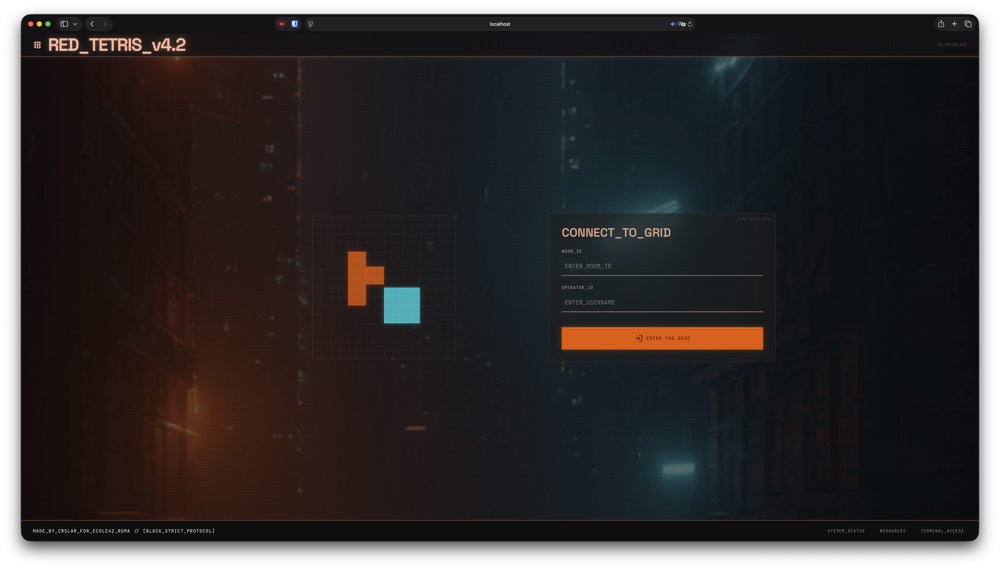
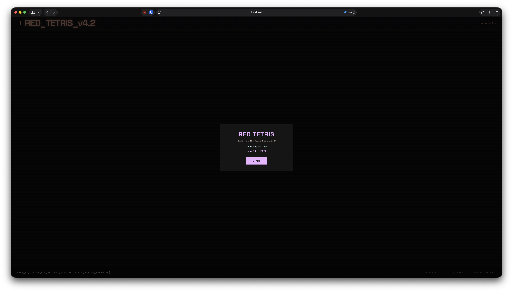
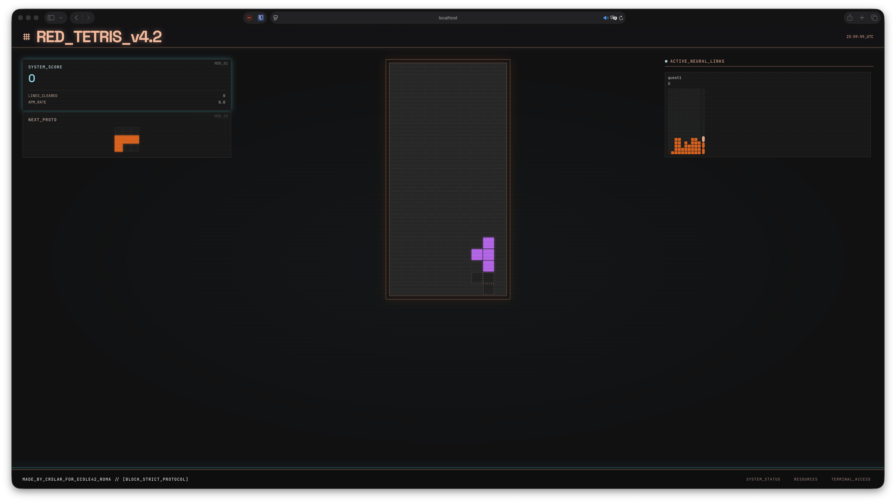

# Red Tetris

> A networked multiplayer Tetris game — tetriminos, pelicans, and full-stack JavaScript.

Built for the [Red Tetris](SUBJECT.pdf) project at École 42.

## In-Game Footage

| Landing Page | Lobby | Multiplayer Game |
|---|---|---|
|  |  |  |

## Architecture

**pnpm monorepo** with two packages:

| Package | Tech | Role |
|---------|------|------|
| `packages/client/` | React 19, Vite 8, Tailwind CSS v4, socket.io-client | SPA game frontend |
| `packages/server/` | Express 5, Socket.io 4, ESM | Game logic + multiplayer |

The client and server share tetris logic via `@red-tetris/shared` workspace package.

## Design Choices

- **Same-piece random spawn** — All players receive the same piece sequence (name + rotation), but spawn column varies per player based on their individual board state. This adds tactical variety without breaking fairness.
- **Spectator mode** — Players can join mid-game as spectators, watching the action and joining the next round.
- **Scoring system** — Added as a bonus feature (`score += lines × 100`) for competitive feedback.
- **Zustand over Redux** — Lighter, hook-native state management for the client, avoiding Redux boilerplate.
- **Custom router** — A zero-dependency hook-based router (`useRoute` + `navigate`) sufficient for the app's two-route needs.
- **SRS rotation** — Standard Super Rotation System with wall kicks for authentic Tetrimino movement.
- **One-frame lock delay** — Pieces don't lock on first collision, giving players a final moment to adjust.

## Getting Started

### Prerequisites

- **Node.js** ≥ 18
- **pnpm** — install with `corepack enable` or `npm i -g pnpm`

### Install dependencies

```bash
pnpm install
```

### Development (hot-reload)

Starts both Express server (`node --watch`) and Vite dev server (HMR on port 5173):

```bash
pnpm dev
```

- Vite proxies `/socket.io` to the Express backend — just open `http://localhost:5173`.
- The server runs on port 3000, but you shouldn't need to access it directly in dev mode.

### Production

Build the client bundle into `packages/server/public/`, then start the server:

```bash
pnpm build
pnpm start
```

The app is now served on **http://localhost:3000**. Set `PORT` env to change the port.

### Run tests

```bash
# Server tests (59 tests)
pnpm --filter server test

# Client tests (166 tests)
pnpm --filter client test

# Both
pnpm --filter server test && pnpm --filter client test
```

### Run coverage metrics

```bash
pnpm --filter server test:coverage
pnpm --filter client test:coverage
```

Current coverage (both packages above thresholds):

| Package | Statements | Branches | Functions | Lines |
|---------|-----------|----------|-----------|-------|
| Server  | 95%       | 88%      | 100%      | 97%   |
| Client  | 82%       | 62%      | 80%       | 83%   |
