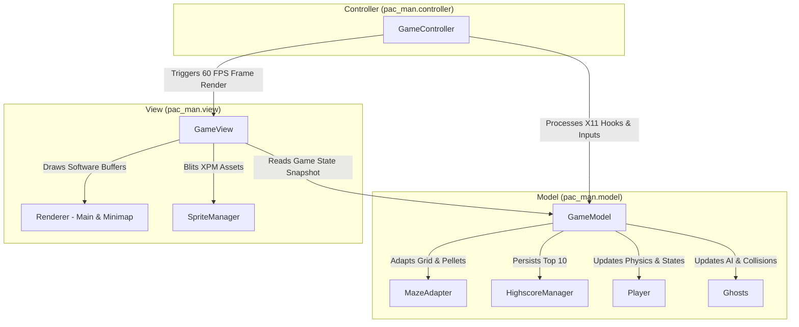

*This project has been created as part of the 42 curriculum by gipimpin, gpecelli.*

# 🟡 Pac-Man 42

[](https://gipstudios.itch.io/pacman)
[](https://github.com/gpimpinelli/pac_man)

A complete, robust recreation of the legendary 1980 arcade game **Pac-Man**, implemented in Python 3.10+ using the **MiniLibX (mlx)** graphical library following a strict **Model-View-Controller (MVC)** software architecture. The game features procedurally generated mazes via external package integration, intelligent ghost state machines, a persistent highscore system, smooth frame-throttled rendering, and evaluation-ready cheat modes.

> 🎮 **Published on itch.io!** Pac-Man 42 is officially published and available to download & play on itch.io:  
> 👉 **[https://gipstudios.itch.io/pacman](https://gipstudios.itch.io/pacman)**

---

## 📖 Table of Contents

- [Description](#-description)
- [Play on itch.io & Packaging](#-play-on-itchio--packaging)
- [Instructions & Setup](#-instructions--setup)
- [Configuration](#-configuration)
- [Highscore System](#-highscore-system)
- [Maze Generation](#-maze-generation)
- [Implementation Details](#-implementation-details)
- [General Software Architecture](#-general-software-architecture)
- [Game Controls & Cheat Mode](#-game-controls--cheat-mode)
- [Project Management](#-project-management)
- [Resources & AI Usage](#-resources--ai-usage)

---

## 📝 Description

**Pac-Man 42** reimagines Namco's timeless arcade classic with modern software engineering practices. The player navigates Pac-Man through complex procedurally generated labyrinths, consuming Pac-Gums and Super Pac-Gums while evading four autonomous ghosts with distinct behavioral states (Chase, Scatter, Frightened, and Eaten).

### Key Features
- **Strict MiniLibX Rendering:** Ultra-fast software frame buffer manipulating direct BGRA bytearrays pushed via `mlx_put_image_to_window`.
- **Procedural Level Progression:** 10+ progressively challenging maze levels generated using an external generator package.
- **Classic Arcade AI:** Multi-state ghost behaviors with Breadth-First Search (BFS) shortest-path navigation for eaten ghost eyes returning to their home base.
- **Fail-Safe Design:** Fault-tolerant JSON parser that gracefully handles missing files, malformed syntax, and out-of-range parameters with zero tracebacks.
- **Evaluation-Ready Cheat Mode:** Peer-review debugging tools to toggle invincibility, skip levels, freeze ghosts, adjust speed, and grant extra lives.

---

## 🕹️ Play on itch.io & Packaging

The project has been packaged and published to **itch.io** in compliance with **Chapter VII (Packaging and Distribution)** of the 42 subject:

👉 **[https://gipstudios.itch.io/pacman](https://gipstudios.itch.io/pacman)**

The published package bundles all standalone wheels, game assets, configuration, and a self-contained execution script.

### Building the Distribution Package

To build the standalone distribution archive yourself:

```bash
make package
# or directly:
uv run python build_package.py
```

This generates `dist/pac-man-42/` and a standalone uploadable archive `dist/pac-man-42-release.zip`.

---

## 🚀 Instructions & Setup

### Requirements
- **OS:** Linux / WSL (Ubuntu 24.04 recommended)
- **Python:** Version 3.10 or later
- **Package Manager:** [`uv`](https://github.com/astral-sh/uv) (recommended) or `pip`

### Installation

Clone the repository and install all dependencies:

```bash
make install
```

*(Alternatively using uv directly: `uv sync`)*

### Execution

Run the game with the default configuration (`config.json`):

```bash
make run
```

As specified in the subject (Chapter V.1), the program accepts a configuration JSON file as its sole command-line argument:

```bash
# Standard Python launch
python3 -m src.pac_man config.json

# Using uv
uv run python -m src.pac_man path/to/custom_config.json
```

### Make Targets

| Target | Description |
|---|---|
| `make install` | Installs project dependencies using `uv sync` |
| `make run` | Launches the game with `config.json` |
| `make package` | Builds standalone release package (ZIP & wheels) for distribution (itch.io) |
| `make debug` | Runs the game under the Python debugger (`pdb`) |
| `make clean` | Removes temporary caches (`__pycache__`, `.mypy_cache`, `uv` cache) |
| `make lint` | Runs `flake8` and `mypy` with non-strict configuration |
| `make lint-strict` | Runs `flake8` and strict static typing check (`mypy --strict`) across all files |

---

## ⚙️ Configuration

The game behavior is fully customizable via a JSON configuration file. In compliance with project specifications, the parser strips line comments starting with `#` or `//`.

### Example `config.json`

```json
{
    // Highscore persistence file
    "highscore_filename": "highscores.json",
    
    // Core gameplay settings
    "lives": 3,
    "seed": 42,
    "level_max_time": 90,
    
    // Scoring rules
    "points_per_pacgum": 10,
    "points_per_super_pacgum": 50,
    "points_per_ghost": 200,
    
    // Level definitions (minimum 10 levels required)
    "levels": [
        { "width": 15, "height": 15 },
        { "width": 15, "height": 15 },
        { "width": 17, "height": 17 },
        { "width": 17, "height": 17 },
        { "width": 19, "height": 19 },
        { "width": 19, "height": 19 },
        { "width": 21, "height": 21 },
        { "width": 21, "height": 21 },
        { "width": 23, "height": 23 },
        { "width": 25, "height": 25 },
        { "width": 27, "height": 27 }
    ]
}
```

### Parameter Reference & Clamping Limits

All parameters are validated and automatically **clamped to safe defaults** if missing, malformed, or out of bounds. The application will never crash or raise an unhandled traceback due to invalid configuration.

| Key | Type | Default | Min | Max | Description |
|---|---|---|---|---|---|
| `lives` | `int` | `3` | `1` | `9` | Starting lives count |
| `seed` | `int` | `42` | `0` | `2,147,483,647` | Base seed for level 1 procedural generation |
| `level_max_time` | `int` | `90` | `10` | `3600` | Countdown timer per level in seconds |
| `points_per_pacgum` | `int` | `10` | `0` | `100,000` | Points awarded per standard Pac-Gum |
| `points_per_super_pacgum` | `int` | `50` | `0` | `100,000` | Points awarded per Super Pac-Gum |
| `points_per_ghost` | `int` | `200` | `0` | `100,000` | Points awarded per ghost eaten while frightened |
| `highscore_filename` | `str` | `"highscores.json"` | — | — | Path to the highscores file |
| `levels` | `list` | *10 levels* | 10 lvls | — | List of dimensions (`width`, `height` must be odd integers $\ge 15$) |

---

## 🏆 Highscore System

The game implements a persistent top 10 highscore leaderboard stored in JSON format (`highscores.json`).

### Implementation & Rationale
- **Why JSON:** Chosen for transparency, human-readability, cross-platform portability, and seamless serialization without external database dependencies.
- **Data Validation & Sanitization:**
  - Player names are strictly sanitized to a maximum of **10 characters**, containing only alphanumeric characters and spaces (`char.isalnum() or char == ' '`).
  - Blank or invalid entries default to `"PLAYER"`.
  - Scores are validated as non-negative integers (`int >= 0`).
- **Resilience:** If the highscores file is missing, empty, or corrupted, the system safely initializes an empty standings list, logs a warning, and saves a clean file without interrupting gameplay.
- **Workflow:** Highscores are loaded at launch, displayed in the dedicated **Highscores Menu**, updated upon game completion (victory or game over), and persisted back to disk immediately.

---

## 🌀 Maze Generation

Level mazes are produced using the external `mazegenerator` wheel package (`mazegenerator-2.1.0-py3-none-any.whl`), integrated strictly as-is without any modifications to its internal code.

### Integration Strategy (`MazeAdapter`)
- **Corridor Compatibility (`PERFECT = False`):** Standard perfect mazes have exactly one path between any two points (no loops). Pac-Man gameplay requires loops and alternate escape routes; the adapter enforces `perfect=False` to create authentic intersecting corridors.
- **Bitmask Conversion:** The external generator outputs raw integers encoding 4-bit wall masks (`NORTH = 1`, `EAST = 2`, `SOUTH = 4`, `WEST = 8`). `MazeAdapter` translates these bitmasks into discrete `Cell` objects with queryable wall properties.
- **Seed Predictability:** Level 1 is deterministically generated using the seed specified in `config.json` (for reproducible evaluation). Subsequent levels dynamically vary their seeds.
- **Entity & Item Spawning:**
  - Pac-Man spawns in the center corridor `(width // 2, height // 2)`.
  - The 4 ghosts spawn in the 4 corners `(0, 0)`, `(width - 1, 0)`, `(0, height - 1)`, and `(width - 1, height - 1)`.
  - Super Pac-Gums are placed at the ghost corner spawn coordinates.
  - Standard Pac-Gums are distributed across all non-solid, traversable corridors.
- **Fallback Safety:** If the external generator encounters an unexpected error, a fallback corridor grid is instantiated to guarantee that the game never crashes.

---

## 💻 Implementation Details

### Low-Level Rendering Pipeline
- **MiniLibX (`mlx`):** Because MiniLibX does not provide hardware acceleration, automated blitting, or sprite sheets, rendering is achieved by constructing a fast 1D bytearray buffer (`BGRA` format) using `mlx_get_data_addr()`.
- **Software Rasterization:** Corridors, background fills, and UI rectangles are written directly into contiguous memory slices (`draw_rect_fast`), and pushed to the window in a single `mlx_put_image_to_window()` call per frame to avoid flickering.
- **Sprite Animation:**
  - Pac-Man features a custom 3-state animated lifecycle: renders as a closed yellow sphere (`pacman_ball.xpm`) when stationary, and cycles rapidly between open and semi-closed mouth sprites (`pacman_*.xpm` and `close_*.xpm`) while in motion.
  - Ghost directional eye sprites and visual cues for frightened (blue) and eaten states.
- **60 FPS Throttling:** `GameController.update_game` tracks delta time (`dt`) via `time.perf_counter()` to enforce an exact 60 FPS update rate independent of display refresh rates.

### Ghost AI State Machine
1. **Scatter:** Ghosts target their respective home corner corridors.
2. **Chase:** Ghosts dynamically target Pac-Man's current grid position.
3. **Frightened:** Triggered by Super Pac-Gums; ghosts slow down, turn blue, and choose pseudo-random escape paths.
4. **Eaten:** Eaten ghosts transform into floating eyes and execute a **Breadth-First Search (BFS)** pathfinding algorithm through `MazeAdapter.breath_first_search()` to calculate the exact shortest route back to their corner respawn point.

---

## 🏛️ General Software Architecture

The project strictly follows the **Model-View-Controller (MVC)** architectural design pattern, ensuring that data logic, presentation, and user input are completely decoupled.



### Module Responsibilities
- **`pac_man.model`**: Manages entity coordinates, velocity vectors, grid navigation, collision detection, game timers, and scorekeeping. Completely independent of graphical libraries.
- **`pac_man.view`**: Manages the MiniLibX window pointer, preloaded XPM image pointers (`SpriteManager`), HUD text strings, minimap scaling, and pixel buffer rendering (`Renderer`).
- **`pac_man.controller`**: Hooks X11 window destroy events and keyboard presses, throttles the frame tick, routes input actions, and transitions game states (`START_MENU`, `PLAYING`, `PAUSE`, `GAME_OVER`, `ENTER_NAME`, `HIGHSCORES`, `INSTRUCTIONS`, `CHEAT_MODE`).

---

## 🎮 Game Controls & Cheat Mode

### Standard Gameplay Controls

| Action | Primary Key | Secondary Key |
|---|---|---|
| **Move Up** | `W` | `↑` (Up Arrow) |
| **Move Down** | `S` | `↓` (Down Arrow) |
| **Move Left** | `A` | `←` (Left Arrow) |
| **Move Right** | `D` | `→` (Right Arrow) |
| **Navigate Menus** | `↑` / `↓` | `W` / `S` |
| **Confirm / Select** | `ENTER` | `SPACE` |
| **Pause / Resume** | `ESC` | `P` |
| **Quit Game** | `ESC` (in menu) | `Q` |

### 🛠️ Cheat Mode (Peer Review Tools)

Press **`6`** during gameplay to toggle **Cheat Mode**. While active, the HUD displays available evaluation shortcuts:

| Key | Cheat Function | Description |
|:---:|---|---|
| **`1`** | **Toggle Invincibility** | Pac-Man becomes impervious to ghost collisions (no lives lost) |
| **`2`** | **Skip Level** | Instantly clears all dots and advances to the next level |
| **`3`** | **Freeze Ghosts** | Halts all ghost movement and intentions immediately |
| **`4`** | **Increase Speed** | Accelerates Pac-Man's movement speed (+10 px/s up to 300 px/s) |
| **`5`** | **Add Extra Life** | Grants +1 life to Pac-Man (up to a maximum of 7 lives) |
| **`6`** | **Exit Cheat Mode** | Resumes normal gameplay |

---

## 📊 Project Management

The development followed an agile, test-driven methodology. Detailed task distributions, timelines, risk analyses, and test acceptance criteria are documented in the project management directory:

👉 **[Read the Full Project Management Documentation](docs/project_management.md)**

---

## 📚 Resources & AI Usage

### References
- **Toru Iwatani & Namco:** Original *Pac-Man* (1980) game design principles.
- **The Pac-Man Dossier by Jamey Pittman:** Indispensable reverse-engineering breakdown of ghost AI personalities, tile targeting, and scatter/chase timing cycles.
- **42 MiniLibX (MLX):** Low-level X-Window graphical interface documentation.
- **Python PEP Standards:** PEP 8 (Style Guide), PEP 257 (Docstrings), and PEP 484 (Static Type Annotations).
- **Pydantic v2:** Robust data validation, field clamping, and model serialization.

### Declaration of AI Usage
In accordance with Chapter II and Chapter IX of the subject, AI tools were utilized during the development process as follows:
- **Assisted Tasks:**
  - Assisting with comprehensive `mypy --strict` typing compatibility across complex generic containers and Pydantic validator lifecycles.
  - Designing optimal edge-case handling for the Breadth-First Search (BFS) shortest path implementation.
  - Formulating mathematical row-symmetry coordinates to generate the standalone `pacman_ball.xpm` sprite.
  - Reviewing docstring formatting against PEP 257 standards.
- **Human Verification & Responsibility:**
  - All AI-assisted suggestions were systematically checked, reviewed, and tested by team members.
  - Every architectural choice (MVC separation, buffer rendering, event routing) was designed, justified, and validated collaboratively by the team.
