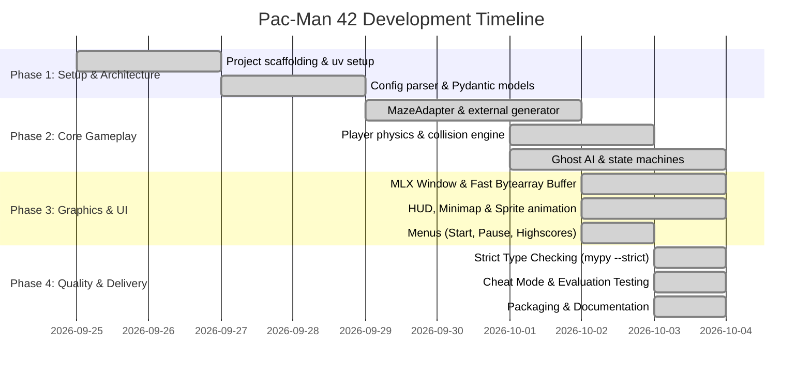

# 📊 Project Management — Pac-Man 42

This document details the project management methodology, organization, planning, and risk management used during the development of **Pac-Man 42**, in compliance with Chapter VIII of the 42 subject.

---

## 1. Team Organization & Roles

| Contributor | Login | Primary Responsibilities |
|---|---|---|
| **Gianluca Pimpinelli** | `gipimpin` | Project architecture, MiniLibX integration, View layout & rendering pipeline, Sprites & HUD, Pause Menu |
| **Giovanni Pecelli** | `gpecelli` | Model logic, MazeAdapter & BFS pathfinding, Config parser & validation, Highscore management, Strict typing & linting |

### Decision-Making & Collaboration Process
- **Git Workflow:** Feature branches merged into `main` after mutual code review.
- **Standards:** All commits had to comply with `flake8` and `mypy --strict` before integration.
- **Conflict Resolution:** Technical trade-offs (e.g. Pydantic validation vs. model mutability, view coordinate mapping) were discussed and resolved through pair-programming sessions.

---

## 2. Project Timeline & Milestones

---

## 3. Risk Analysis & Mitigation Strategies

| Identified Risk | Severity | Mitigation Strategy Implemented |
|---|---|---|
| **External Maze Generator Crashes** | High | Implemented resilient `try/except` in `MazeAdapter.generate()` with safe fallback maze matrix so the game never crashes. |
| **Faulty or Missing Config File** | High | Created strict `ConfigParser` with automatic value clamping to safe minimums/maximums; invalid values never throw tracebacks. |
| **WSL / Linux Audio & Display Limits** | Medium | Built rendering on pure MiniLibX X11 bytearray buffer without third-party graphics/sound engine dependencies, ensuring portability. |
| **Strict Typing Regressions** | Medium | Integrated `make lint-strict` target running `mypy --strict` on all 21 source files to catch typing issues before review. |
| **State Desynchronization (MVC)** | Medium | Ensured unidirectional flow: Controller receives raw events, updates Model physics, View queries Model snapshot to draw. |

---

## 4. Acceptance Test Plan

| Feature Tested | Test Case / Scenario | Expected Outcome | Result |
|---|---|---|---|
| **Config Robustness** | Empty config, missing keys, invalid types, comments `#` and `//` | Clamped to safe defaults, clear message printed, no crash | **PASS** |
| **External Maze** | Odd dimensions (15x15 to 27x27), non-perfect maze flag | Generates traversable corridors and loops without wall blocks | **PASS** |
| **Player Movement** | WASD / Arrows into walls and corridors | Cannot penetrate walls, smooth rail snapping at intersections | **PASS** |
| **Ghost AI** | Chase, Scatter, Frightened (Super Pac-Gum), Eaten | Correct behavior in each state, BFS return path to corner | **PASS** |
| **Highscores** | Corrupted JSON, name > 10 chars, special characters | Sanitized to max 10 alphanumeric chars, saved and sorted | **PASS** |
| **Cheat Mode** | Toggle `[6]`, test 1 (invincibility), 2 (skip), 3 (freeze), 4 (speed), 5 (lives) | Reviewer can inspect any level and mechanic easily | **PASS** |
| **Code Quality** | `make lint` and `make lint-strict` | Zero flake8 violations, zero mypy errors across all files | **PASS** |
